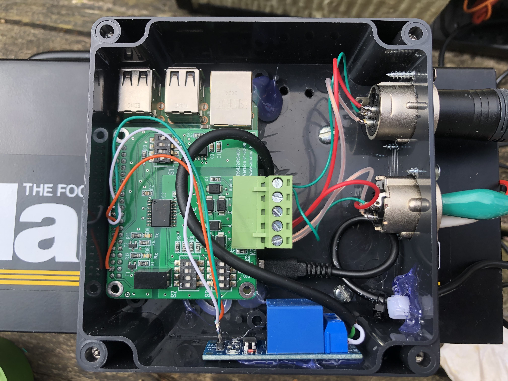

# DMX for Martin Junior 700

This projects allows you to control your Martin Junior 700 fogger via DMX. The
Junior 700 is a compact and rugged little fogger, but does not come with DMX
control. When the control box for this fogger got misplaced, we took the
opportunity to hook it up to the DMX loop for remote control.

The new control box contains a Raspberry Pi with an RS-485 HAT and a relay. The
relay simply bridges pins 3 and 5 on what used to be the control box's DIN
connector. We chose to mount the box on the fogger's side, but you can also give
it a DIN connector and use it as external control unit.

What is good to understand is that DMX consoles use logarithmic signals. The
values are also not very precise, especially on consoles with short faders. You
might plan some time to just experiment with the values that your console sends
for certain fader positions.

We use Wireguard and GIT for remote access and versioning of the code on the
control box. Documentation for that can be found elsewhere, so we don't go into
that here.

## Parts List

These are the parts that we used in this project:

* A Raspberry Pi. Any will do. We used a full size one because that's what we had. In hindsight, a smaller one would have been a better choice, or even an Arduino with an RS-485 shield.
* [Zihatec RS-485 HAT](https://www.hwhardsoft.de/english/projects/rs485-shield/). Any RS-485 HAT will do, of course. If you have the choice, the screw terminals are probably a better choice than the full connector version that we used.
* [A 5V Relay](https://www.tinytronics.nl/shop/en/switches/relays/5v-relay-1-channel-high-active). Not affiliated, just a shop I use regularly.
* Housing. We used the [Tru Components KST 217 122 x 120 x 55 ABS](https://www.conrad.nl/nl/p/tru-components-kst-217-03217000-h-universele-behuizing-122-x-120-x-55-abs-leigrijs-1-stuk-s-1483263.html). It is important to consider the inside dimensions of the house you pick. Leave some room for wiring and the bulky XLR chassis connectors.
* XLR male and XLR female chassis connectors.
* An assortment of wires, zip ties and heat shrink.

## Wiring

It is probably good if you take a little time to design your wiring. Our project
grew in steps and that means some of the wiring could have been done nicer. For
example, the relay board is wired to the Raspberry Pi by soldering onto the I/O
header of the RS-485 shield. That is certainly not ideal.

The DMX wiring is as follows (K2 is the 5 pin connector on the RS-485 HAT):

* data +: XLR pin 3 to K2 pin 1
* data +: XLR pin 2 to K2 pin 2
$ ground: XLR pin 1 to K2 pin 5

The relay wiring for GPIO BCM pin 25 is on physical pin 22, giving the following
connections:

* GPIO header pin 4 (5V) to relay `Vcc`.
* GPIO header pin 20 (GND) to relay `GND`.
* GPIO header pin 22 (GPIO 25) to relay `in`.

Finally, the relay is wired to the Martin's DIN connector:

* relay common: Martin's DIN connector 3
* relay normally open: Martin's DIN connector 5

We ended up removing the DIN connector entirely, adding a manual control switch
too, but you may want to leave the DIN connector intact.

## Enabling DMX over RS-485

On the HAT, set the DIP switched to the following values:

* S1: off-on-on-off
* S2: off-off-on-on
* S3: off-off-off-off

This assumes that you will use an external DMX loop terminator.

## Testing Without a DMX Console

Testing is probably best done using a DMX console. If you have a second
Raspberry Pi and RS-485 HAT, you can also use that to generate the test signals.
Keep in mind that actual console signals are more messy that programmatic ones.

We used [DmxUniverse - Interface to dmx serial on Windows](https://github.com/Ray-electrotechie/Serial-dmx-with-python3)
by Ray Electrotechie. In spite of the repository name, this code runs perfectly
fine on Linux.

Have fun and let us know if you see any improvements.
